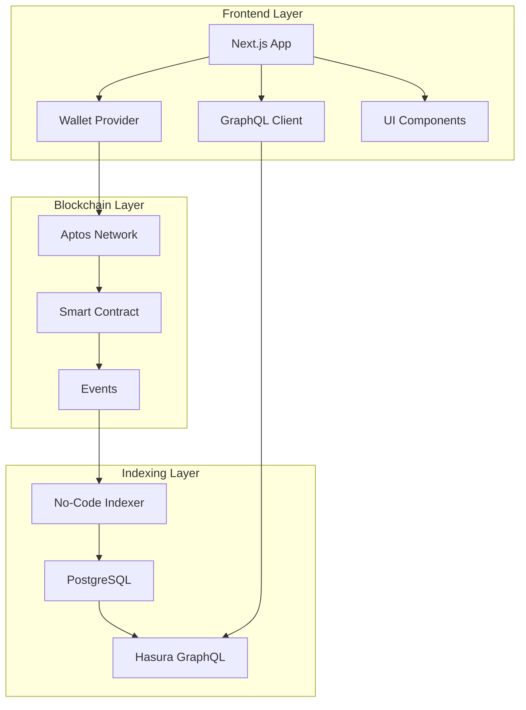

# Architecture Deep Dive

## 🏗️ System Overview

The Playlist Poem dApp is built using a modern Web3 architecture that combines traditional web development with blockchain technology.



## 🔄 Data Flow

### Comment Submission Flow

1. **User Action**: User types comment and clicks submit
2. **Wallet Integration**: Frontend calls Aptos Wallet Adapter
3. **Transaction Building**: `postComment` function creates transaction payload
4. **Blockchain Execution**: Smart contract executes `post_message` function
5. **Event Emission**: Contract emits `MessagePostedEvent` 
6. **Indexer Processing**: No-Code Indexer captures event within seconds
7. **Database Update**: Event data stored in PostgreSQL via Hasura
8. **Frontend Update**: Apollo Client polls and displays new comment

### Comment Display Flow

1. **Page Load**: Frontend initializes GraphQL client
2. **Query Execution**: Apollo Client queries Hasura endpoint
3. **Data Retrieval**: PostgreSQL returns comment history
4. **UI Rendering**: Comments displayed with author/timestamp formatting
5. **Real-time Updates**: Polling every 10 seconds for new comments

## 🧩 Component Architecture

### Frontend Components

```typescript
// Component Hierarchy
App
├── PlaylistPoem              // Main poem display
│   ├── TrackTable           // Playlist tracks with streaming links
│   ├── PoemContent          // Generated poem from track names
│   └── CommentSection       // Comment form + history
│       ├── CommentForm      // Submit new comments
│       └── PoemComments     // Display comment history
└── WalletProvider           // Wallet connection context
```

### Smart Contract Structure

```move
module message_board_addr::message_board {
    // Core data structures
    struct Message has key {
        string_content: String,
    }
    
    struct BoardObjectController has key {
        extend_ref: ExtendRef,
    }
    
    // Event for indexing
    #[event]
    struct MessagePostedEvent has drop, store {
        author: address,
        content: String,
        timestamp: u64,
    }
    
    // Entry functions
    public entry fun post_message(sender: &signer, content: String)
    
    // View functions  
    #[view]
    public fun get_message_content(): String
    #[view] 
    public fun exist_message(): bool
}
```

## 🔐 Security Model

### Wallet Security
- **Non-custodial**: Users control their private keys
- **Permission-based**: Explicit approval for each transaction
- **Network isolation**: Testnet/Mainnet separation

### Smart Contract Security
- **Access control**: Only message authors can post
- **Input validation**: String length limits (500 chars)
- **Event integrity**: Immutable blockchain events
- **Upgrade pattern**: Object-based deployment for upgrades

### Frontend Security
- **Environment isolation**: Separate keys for dev/prod
- **API key protection**: Server-side validation
- **Input sanitization**: XSS prevention
- **HTTPS enforcement**: Secure data transmission

## 📊 Data Models

### On-Chain Data (Move)

```move
// Current message (overwrites previous)
struct Message {
    string_content: String,
}

// Event history (permanent)  
struct MessagePostedEvent {
    author: address,     // 0x724ddb926b76592c5d3cbe44ceef9a4b585d179cd3db685f506914a8a46c727b
    content: String,     // "Beautiful playlist poem! Love the connection between..."
    timestamp: u64,      // 1732595623000000 (microseconds)
}
```

### Off-Chain Data (PostgreSQL)

```sql
-- Table: comment
CREATE TABLE comment (
    id SERIAL PRIMARY KEY,
    author TEXT NOT NULL,        -- Maps to event.author
    content TEXT NOT NULL,       -- Maps to event.content  
    when BIGINT NOT NULL,        -- Maps to event.timestamp
    created_at TIMESTAMP DEFAULT NOW()
);
```

### Frontend Data (TypeScript)

```typescript
interface PoemComment {
    author: string;     // "0x724ddb...6c727b"
    content: string;    // User's comment text
    when: string;       // ISO timestamp string
}

interface PlaylistTrack {
    order: number;
    title: string;
    artist: string;
    album: string;
    spotify: string;
    apple: string;
    tidal: string;
}
```

## 🔄 State Management

### Client-Side State

```typescript
// Apollo Client Cache
const apolloClient = new ApolloClient({
    cache: new InMemoryCache({
        typePolicies: {
            Query: {
                fields: {
                    comment: {
                        merge(existing = [], incoming) {
                            return incoming; // Replace with fresh data
                        },
                    },
                },
            },
        },
    }),
});

// React Component State
const [comment, setComment] = useState("");           // Form input
const [isSubmitting, setIsSubmitting] = useState(false); // Loading state
const { connected, account } = useWallet();             // Wallet state
```

### On-Chain State

```move
// Global state (single message board)
let message = borrow_global_mut<Message>(get_board_obj_address());
message.string_content = new_string_content; // Overwrites previous

// Event log (append-only history)
event::emit(MessagePostedEvent {
    author: signer::address_of(sender),
    content: new_string_content,
    timestamp: timestamp::now_microseconds(),
}); // Permanent record
```

## 🚀 Performance Optimizations

### Frontend Optimizations

1. **Static Generation**: Poem content pre-rendered at build time
2. **Code Splitting**: Dynamic imports for wallet components
3. **Image Optimization**: Next.js automatic image optimization
4. **Caching**: Apollo Client query caching with 10s polling
5. **Bundle Analysis**: Tree shaking for minimal JavaScript

### Blockchain Optimizations

1. **Gas Efficiency**: Minimal contract storage (single message)
2. **Event Indexing**: Off-chain storage for comment history
3. **Batch Operations**: Future: Multiple comments per transaction
4. **Object Pattern**: Upgradeable contract without migration

### Database Optimizations

1. **Indexing**: Database indexes on author, timestamp
2. **Query Optimization**: GraphQL query complexity limits
3. **Connection Pooling**: Hasura connection management
4. **Real-time**: WebSocket subscriptions (future feature)

## 🔌 Integration Points

### Aptos Build Platform

```yaml
# Organization: poem-app
# Project: playlist-poems

Applications:
  - poem-api (Api): AG-4THAS9ZNBFIMAONXEVVO6C2Z7IFKBUWB7
  - indexer-message (Nci): aptoslabs_X48xA7mBcF2_3YWqiu3tyTrvb2nCxYG9oeJgcrRGChdKK

Processor Configuration:
  network: testnet
  starting_version: 6821308723
  contract_address: 0xa805a1889e99d39545da3011c2a2d5836172d0409d61b533226150a57eeaccc0
  event_type: MessagePostedEvent
```

### External Services

```typescript
// Streaming Platform APIs
const streamingLinks = {
    spotify: "https://open.spotify.com/track/{id}",
    apple: "https://music.apple.com/search?term={query}",  
    tidal: "https://listen.tidal.com/search?q={query}"
};

// Blockchain Explorer
const explorerUrl = `https://explorer.aptoslabs.com/account/${address}?network=${network}`;
```

## 🧪 Testing Strategy

### Unit Tests
- **Smart Contract**: Move unit tests with test harnesses
- **Frontend Components**: Jest + React Testing Library
- **GraphQL Queries**: Apollo MockedProvider
- **Utility Functions**: Pure function testing

### Integration Tests
- **Wallet Integration**: E2E transaction testing
- **Indexer Pipeline**: Event emission → database verification
- **API Integration**: GraphQL schema validation
- **Cross-browser**: Wallet compatibility testing

### Contract Tests

```move
#[test(sender = @message_board_addr, aptos_framework = @0x1)]
fun test_post_message(sender: &signer, aptos_framework: &signer) {
    timestamp::set_time_has_started_for_testing(aptos_framework);
    init_module_for_test(sender);
    
    post_message(sender, string::utf8(b"Test comment"));
    
    let content = get_message_content();
    assert!(content == string::utf8(b"Test comment"), 1);
}
```

## 🔮 Future Architecture

### Planned Enhancements

1. **Multi-Poem Support**: Contract factory pattern
2. **Gas Station Integration**: Sponsored transactions
3. **NFT Collectibles**: Poem minting capabilities
4. **Social Graph**: User follow/like system
5. **Real-time Features**: WebSocket subscriptions
6. **Mobile App**: React Native implementation

### Scalability Considerations

1. **Layer 2**: Future migration to Aptos Layer 2
2. **CDN**: Global content distribution
3. **Database Sharding**: Comment history partitioning
4. **Microservices**: API decomposition
5. **Caching Layer**: Redis for hot data

---

*This architecture enables a seamless blend of traditional web UX with blockchain functionality, providing users with familiar interfaces while leveraging the security and permanence of decentralized technology.*